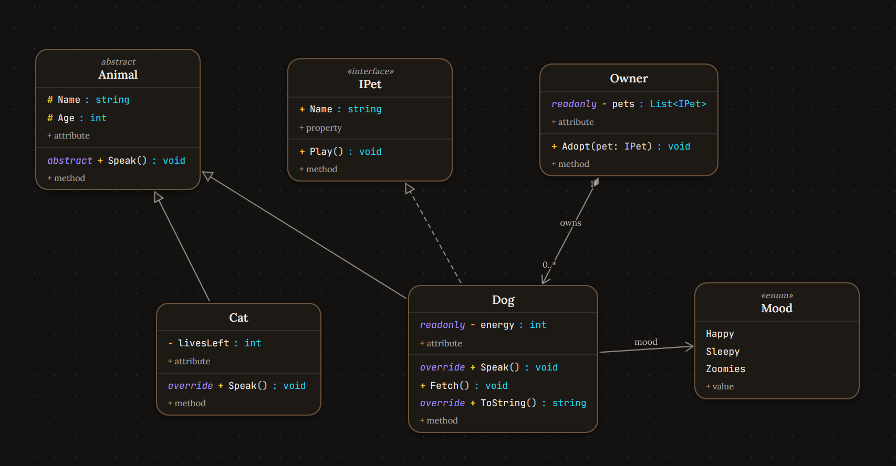

<div align="center">
  
</div>

<div align="center">
  
</div>

A fast, fluid UML **class diagram editor** for the web. Classic diagram tools are
**drag-and-drop**: you drag boxes around, resize them, and wrestle text inside rectangles.
Here the canvas is not a drawing surface — it is a live document. You **click a `+` to add
attributes and methods**, edit everything **in place** (inline, like a text field), and link
types with proper UML relations. Layout stays tidy automatically; you spend your time
modeling, not moving rectangles.

Built with **Node + Vite + TypeScript + CSS** (no framework). Published as the npm package
`artisan-uml`: install it with `npm install artisan-uml` to serve the built editor yourself
or reuse its layout engine in your own tools.

[](https://www.npmjs.com/package/artisan-uml)  

## Why I built this

I'm [Óscar Delgado](https://oscardelgado.dev), a software engineer. Before starting a
project, or when adding a new feature, I like to plan the architecture first. It is
how I keep the codebase solid as it grows.

The problem: the tools for that moment never felt right. Most UML editors are slow and
clunky to work with. You drag rectangles, fight menus, and the bigger and more complex
your system gets, the less nice it feels to keep the diagram up to date.

Artisan UML is my answer to that. I wanted designing software to feel as fluid as
writing code: click a `+`, type, link, done, and let the layout take care of itself.
You spend your energy on the architecture, not on the tool.

I released it as open source so that as many people as possible can use it, and
hopefully it can help a lot of developers. If it makes planning your next project
nicer, it was worth building.

## Quick start

### Option 1: the npm package (easiest)

No cloning, no build step. The editor ships as the npm package `artisan-uml`:

```bash
pnpm add artisan-uml
pnpm dlx serve node_modules/artisan-uml/dist
```

### Option 2: from source

Requires [Node.js](https://nodejs.org) 18+ and [pnpm](https://pnpm.io) (or npm).

```bash
git clone https://github.com/oscardelgado02/artisan-uml
cd artisan-uml
pnpm install     # install dependencies
pnpm dev         # start dev server with hot reload
pnpm build       # typecheck + production build into dist/
pnpm test        # layout + CSS contract checks
pnpm preview     # serve the production build
```

### Layout contract

`layout-constants.mjs` is the single source of truth for box-size math (character
width, node cap, wrap budgets). `Tidy` and the auto-layout estimate node sizes from
the same numbers. If you change the constants or the diagram JSON shape, bump
`CONTRACT_VERSION` — `pnpm test` checks the CSS and layout against the constants.

## Features

### Nodes

- **Kinds**: class, abstract class, interface, enum, record, struct
  (stereotypes like `«interface»` / `«enum»` are shown on the header).
- **Kind-appropriate members** — interfaces show **properties + methods**,
  enums show **values** only (`Name = 1`, value optional), everything else has
  attributes + methods.
- **Add members in one click** — every box has `+ attribute` / `+ method` /
  `+ value` buttons, or right-click a box → *Add attribute / method / value*.
- **Inline editing** — click the class name (or right-click → *Rename*) to edit it in place.
  Double-click the empty canvas to instantly create a new class and start naming it.
- **Member editor popover** — click any member row to edit:
  - **Visibility**: `+` public, `-` private, `#` protected, `~` internal
    (also settable via right-click on the row, or by clicking through the menu)
  - **Name**, **type** (attribute) or **return type** (method)
  - **Parameters**, e.g. `dx: int, dy: int`
  - **Modifier chips**: `static`, `abstract`, `readonly`, `virtual`, `override`,
    `sealed`, `async`, `const`
- **Syntax coloring**: names use the inverse-of-background color, visibility is
  **orange**, types are **cyan**, modifiers are **purple** (theme-aware).

### Relations

Three ways to create one:

1. **Drag a node's border** (the outer ~8 px ring, crosshair cursor) onto another
   node — a menu pops up to pick the relation kind. Drop it on the same node for
   a **self-relation** (e.g. a singleton).
2. **Right-drag** from a node to a node — same menu on drop.
3. Pick a relation in the toolbar, then click the **source** node and the
   **target** node (`Esc` or a click on empty canvas cancels).

| Relation | Notation |
| --- | --- |
| Inheritance (extends) | solid line + hollow triangle |
| Realization (implements) | dashed line + hollow triangle |
| Composition (owns) | filled diamond at the owner |
| Aggregation (has-a) | hollow diamond at the owner |
| Association | solid line + open arrow |
| Dependency | dashed line + open arrow |

Self-relations render as a small loop on the right side of the node.

Click any relation to edit its **type, label and multiplicities** (`1`, `0..*`, …),
reverse it, or delete it. Toggle **Color links** in the toolbar to paint all
relations in the accent color so they stand out from the class boxes.

### Editor features

- **Themes** — four palettes, each with light/dark mode: **Default** (warm brass),
  **Developer** (violet neon), **Artisan** (parchment & ink, serif class names),
  **Navy** (deep sea, gold highlights).
- **Undo / redo** — `Ctrl+Z` / `Ctrl+Shift+Z`
- **Autosave** to `localStorage`
- **Pending-change highlights** — changes the human hasn't seen yet render amber until
  accepted: additions glow, removals render as dashed struck-through **tombstones**
  (draggable, they skip themselves if the item comes back). The served editor re-reads
  `diagram.json` every 5s, so terminal edits (`artisan add`/`edit`/`remove`) light up live.
- **Per-item review** — every amber item (real or tombstone) carries ✓ / ✕ chips:
  accept or reject individually; the ✕ side reverts the diagram (per-ref ghost reverts,
  or full restore from the last human state). Global "Mark AI changes seen" and
  "Reject AI changes" buttons handle everything at once.
- **Code out of sync badge** — while the code differs from the diagram (`artisan
  impl-diff`: classes/members/relations missing from the code, code drift, signature
  mismatches), an ⚠ **Code out of sync** label sits next to the review buttons; hover
  it for the counts and the fix (`artisan impl-diff` → `/artisan-implement`).
- **Disk-first saving** — the served editor saves with a revision guard (`If-Match`);
  a stale tab that tries to save over newer disk state gets rejected and reloads it.
- **Pan** by dragging the canvas (or middle mouse), **zoom** with `Ctrl+scroll`
  or pinch, zoom widget bottom-right, fit-view button
- **Delete** key removes the selected node/relation

### Import / export

- **Export / Import JSON** — full-fidelity diagram files (Import has its own
  toolbar button, and also lives in the Export menu)
- **PlantUML** — copy or download your diagram as `.puml` text

## Project structure

```
├── index.html             entry page (theme boot script + toolbar/canvas markup)
├── layout-constants.mjs   shared box-size knobs + CONTRACT_VERSION
├── layout.mjs             layered auto-layout engine (used by Tidy)
├── package.json           published npm package: ships dist/ + layout-constants
├── test/contract.mjs      package contract test (constants, layout, CSS rules)
├── tsconfig.json          strict TypeScript config
├── docs/                  documentation site (docsify, hosted on GitHub Pages)
└── src/
    ├── main.ts            event wiring, toolbar, boot
    ├── model.ts           domain types + constants (node kinds, relations, visibility)
    ├── render.ts          node/edge rendering, pan & zoom camera
    ├── storage.ts         localStorage persistence + undo/redo history
    ├── editors.ts         context menus, member/relation popovers, inline rename
    ├── exporters.ts       JSON + PlantUML export/import
    ├── tidy.ts            re-layout via the layered engine ("Tidy" button)
    ├── types.ts           shared UI types
    └── style.css          theme variables (light/dark) + all styling
```

## Data model

```ts
interface Member {
  id: string;
  vis: '+' | '-' | '#' | '~';
  name: string;
  type: string;          // attribute type / method return type
  mods: string[];        // static, abstract, readonly, ...
  params: string | null; // method parameters, e.g. "dx: int, dy: int"
}

interface UmlNode {
  id: string;
  kind: 'class' | 'abstract' | 'interface' | 'enum' | 'record' | 'struct';
  name: string;
  x: number; y: number;
  attributes: Member[];
  methods: Member[];
}

interface UmlEdge {
  id: string;
  kind: 'association' | 'inheritance' | 'realization' | 'dependency'
      | 'aggregation' | 'composition';
  from: string; to: string;   // node ids
  label: string;
  fromMult: string; toMult: string;
}
```

## Theming

All colors live as CSS custom properties in `src/style.css`, mirroring the light/dark
split (`html` vs `html.dark`) used by the cards the design is based on:

| Token | Used for |
| --- | --- |
| `--card-bg`, `--card-border`, `--card-shadow` | class box cards |
| `--primary-from` / `--primary-to`, `--accent-glow` | accent, selected-box animated border |
| `--vis-orange`, `--type-cyan`, `--mod-purple` | member syntax coloring |
| `--edge-default` / `--edge-colorize` | relation strokes (default vs "Color links") |
| `--edge-selected` | selected-relation highlight |

## Keyboard shortcuts

| Key | Action |
| --- | --- |
| `Ctrl+Z` | Undo |
| `Ctrl+Shift+Z` / `Ctrl+Y` | Redo |
| `Delete` / `Backspace` | Delete selection |
| `Esc` | Close menus / cancel linking / deselect |
| Double-click canvas | New class |
| Right-click | Context menus everywhere |

## Documentation

Full documentation lives in [`docs/`](docs/) and is hosted on GitHub Pages:
**[Documentation](https://editor.artisan-uml.dev/docs/)** — getting
started, editing, relations, themes and keyboard reference.

## Community

- [Contributing](CONTRIBUTING.md) — dev setup, tests and PR expectations
- [Code of Conduct](CODE_OF_CONDUCT.md) — Contributor Covenant
- [Security](SECURITY.md) — how to report vulnerabilities privately
- [Changelog](DEVLOG.md) — what changed, day by day

## License

[MIT](LICENSE) © Óscar Delgado
